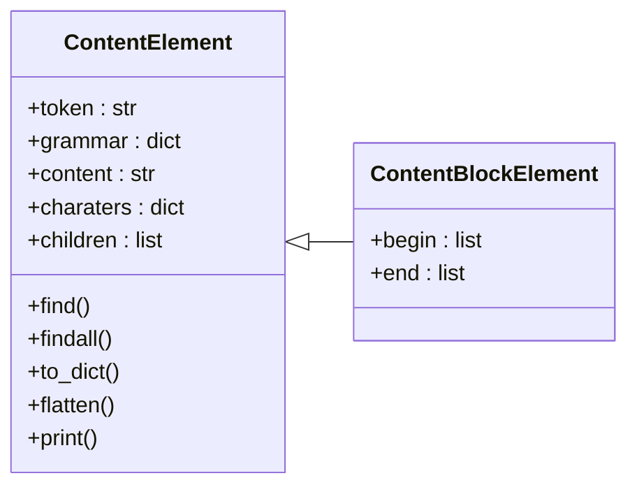

# Element operations

The [`parse_file`](#textmate_grammar.language.LanguageParser.parse_file) and [`parse_string`](#textmate_grammar.language.LanguageParser.parse_string) methods of the [`LanguageParser`](#textmate_grammar.language.LanguageParser) both return either `None` if the content could not be parsed, or a [`ContentElement`](#textmate_grammar.elements.ContentElement) or [`ContentBlockElement`](#textmate_grammar.elements.ContentBlockElement) if parsing was successful.



Every matching is defined by its `grammar` and identifier `token`. The matching is available under `content` as string and under `characters` as a dictionary of single charaters, with the position in the source file as the dictionary keys. 

## Output standard types

As illustrated on the [homepage](index.md), the [`print`](#textmate_grammar.elements.ContentElement.print) method prints the nested data structure in dictionary format on the command line. The dictionary output can also be requested through the [`to_dict`](#textmate_grammar.elements.ContentElement.to_dict) method.


Alternatively, with the [`flatten`](#textmate_grammar.elements.ContentElement.flatten) method, a list of tuples is returned with every entry representing the unique tokenized elements from start to finish:

- tuple of line number, position on line
- string of the content
- list of tokens 

This representation is more akin to the output of [vscode-textmate](https://github.com/microsoft/vscode-textmate). The "flattened" output can be printed in the command line by the `flatten` keyword. 

```python
>>> element.print(flatten=True)

[[(0, 0), 'value', ['source.matlab', 'meta.assignment.variable.single.matlab', 'variable.other.readwrite.matlab']],
 [(0, 5), ' ', ['source.matlab']],
 [(0, 6), '=', ['source.matlab', 'keyword.operator.assignment.matlab']],
 [(0, 7), ' ', ['source.matlab']],
 [(0, 8), 'num2str', ['source.matlab', 'meta.function-call.parens.matlab', 'entity.name.function.matlab']],
 [(0, 15), '(', ['source.matlab', 'meta.function-call.parens.matlab', 'punctuation.section.parens.begin.matlab']],
 [(0, 16), '10', ['source.matlab', 'meta.function-call.parens.matlab', 'constant.numeric.decimal.matlab']],
 [(0, 18), ')', ['source.matlab', 'meta.function-call.parens.matlab', 'punctuation.section.parens.end.matlab']],
 [(0, 19), ';', ['source.matlab', 'punctuation.terminator.semicolon.matlab']]]
```


