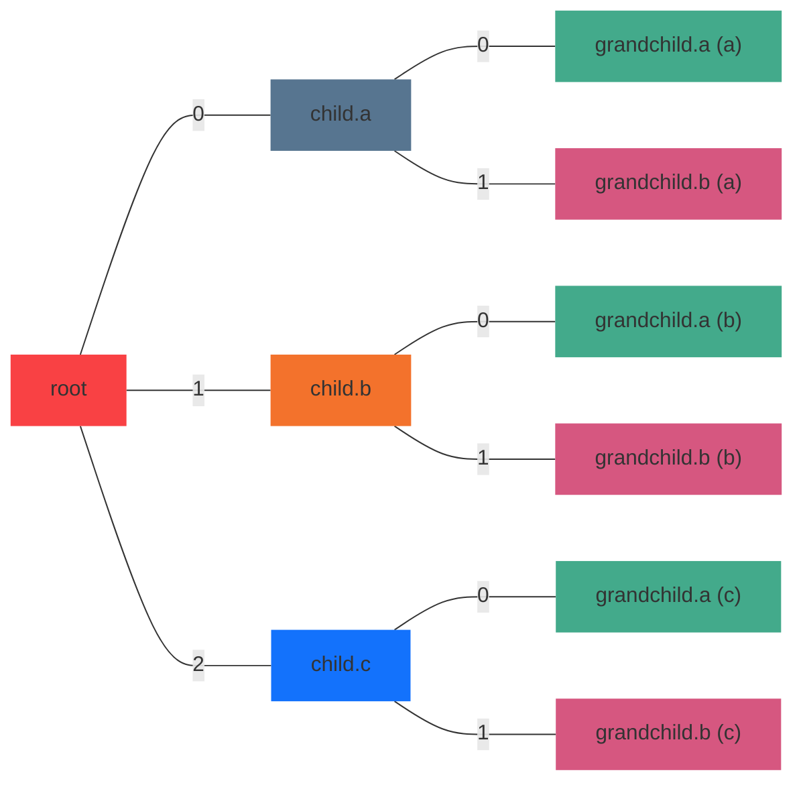

# Element operations

The [`parse_file`](#textmate_grammar.language.LanguageParser.parse_file) and [`parse_string`](#textmate_grammar.language.LanguageParser.parse_string) methods of the [`LanguageParser`](#textmate_grammar.language.LanguageParser) both return either `None` if the content could not be parsed, or a [`ContentElement`](#textmate_grammar.elements.ContentElement) or [`ContentBlockElement`](#textmate_grammar.elements.ContentBlockElement) if parsing was successful.


Every matching is defined by its `grammar` and identifier `token`. The matching is available under `content` as string and under `characters` as a dictionary of single charaters, with the position in the source file as the dictionary keys. 

## Output standard types

As illustrated on the [homepage](index.md), the [`print`](#textmate_grammar.elements.ContentElement.print) method prints the nested data structure in dictionary format on the command line. The dictionary output can also be requested through the [`to_dict`](#textmate_grammar.elements.ContentElement.to_dict) method.


Alternatively, with the [`flatten`](#textmate_grammar.elements.ContentElement.flatten) method, a list of tuples is returned with every entry representing the unique tokenized elements from start to finish:

- tuple of line number, position on line
- string of the content
- list of tokens 

This representation is more akin to the output of [vscode-textmate](https://github.com/microsoft/vscode-textmate). The "flattened" output can be printed in the command line by the `flatten` keyword. 

```python
>>> element.print(flatten=True)

[[(0, 0), 'value', ['source.matlab', 'meta.assignment.variable.single.matlab', 'variable.other.readwrite.matlab']],
 [(0, 5), ' ', ['source.matlab']],
 [(0, 6), '=', ['source.matlab', 'keyword.operator.assignment.matlab']],
 [(0, 7), ' ', ['source.matlab']],
 [(0, 8), 'num2str', ['source.matlab', 'meta.function-call.parens.matlab', 'entity.name.function.matlab']],
 [(0, 15), '(', ['source.matlab', 'meta.function-call.parens.matlab', 'punctuation.section.parens.begin.matlab']],
 [(0, 16), '10', ['source.matlab', 'meta.function-call.parens.matlab', 'constant.numeric.decimal.matlab']],
 [(0, 18), ')', ['source.matlab', 'meta.function-call.parens.matlab', 'punctuation.section.parens.end.matlab']],
 [(0, 19), ';', ['source.matlab', 'punctuation.terminator.semicolon.matlab']]]
```

## Accessing descendent elements

To find specific descendent elements, instead of indexing manually through the `children` (or `begin` and `end`) attribute, use the provided methods [`find`](#textmate_grammar.elements.ContentElement.find), which yields the found descendent elements one by one, and [`findall`](#textmate_grammar.elements.ContentElement.findall), which returns all descendents as a list.




For example, for an example element tree above, the table below shows the possible return values of `findall` on the root element with different criteria. 

| Input | Output | 
| ----- | ------ |
| `root.findall(tokens='grandchild.a')` | grandchild.a (a, b, c) |
| `root.findall(tokens='grandchild.a', depth=1)` |  |
| `root.findall(tokens='grandchild.a', start_tokens='child.b')` | grandchild.a (b,c) |
| `root.findall(tokens='grandchild.a', stop_tokens='child.c')` | grandchild.a (a,b) |
| `root.findall(tokens=['child.a', 'child.b'])` | child.a, child.b |
| `root.findall(tokens='*', hide_tokens='child.c', depth=1)` | child.a, child.b |
