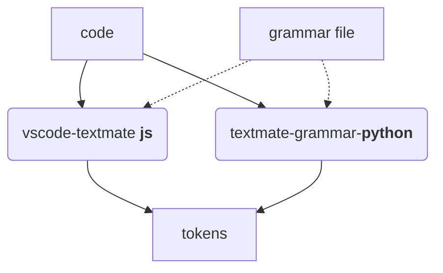

[](https://github.com/astral-sh/ruff)
[](http://mypy-lang.org/)
[](https://github.com/pre-commit/pre-commit)
[](https://github.com/watermarkhu/textmate-grammar-python/blob/main/.github/workflows/ci.yml)
[](https://textmate-grammar-python.readthedocs.io)

A lexer and tokenizer for grammar files as defined by TextMate and used in VSCode, implemented in Python. 

Textmate grammars are made for [vscode-texmate](https://github.com/microsoft/vscode-textmate), allowing for syntax highlighting in VSCode after tokenization. This presents textmate-grammar-python with a large list of potentially supported languages. 



## Installation
Install the module with:
```bash
pip install textmate-grammar-python
```

Or, for development purposes, clone the repository and install locally with [poetry](https://python-poetry.org/), and setup [pre-commit](https://pre-commit.com/) such that code is linted and formatted with [Ruff](https://docs.astral.sh/ruff/) and checked with [mypy](https://mypy-lang.org/).

```bash
pip install poetry
git clone https://github.com/watermarkhu/textmate-grammar-python
cd textmate-grammar-python
poetry install
pre-commit install
```
For instructions on running the unit and regression tests see [CONTRIBUTING.md](https://github.com/watermarkhu/textmate-grammar-python/blob/main/CONTRIBUTING.md)


## Usage
Before tokenization is possible, a [`LanguageParser`](#textmate_grammar.language.LanguageParser) needs to be initialized using a loaded grammar. 

```python
from textmate_grammar.language import LanguageParser
from textmate_grammar.grammars import matlab
parser = LanguageParser(matlab.GRAMMAR)
```

After this, one can either choose to call [`parser.parsing_string`](#textmate_grammar.language.LanguageParser.parse_string) to parse a input string directly, or call [`parser.parse_file`](#textmate_grammar.language.LanguageParser.parse_file) with the path to the appropiate source file as the first argument, such as in the example [`example.py`](../example.py). 

The parsed `element` object can be displayed directly by calling the [`print`](#textmate_grammar.elements.ContentElement.print) method. By default the element is printed as an element tree in a dictionary format. 

```python
>>> element = parser.parse_string("value = num2str(10);")
>>> element.print()

{'token': 'source.matlab',
 'children': [{'token': 'meta.assignment.variable.single.matlab', 
               'children': [{'token': 'variable.other.readwrite.matlab', 'content': 'value'}]},
              {'token': 'keyword.operator.assignment.matlab', 'content': '='},
              {'token': 'meta.function-call.parens.matlab',
               'begin': [{'token': 'entity.name.function.matlab', 'content': 'num2str'},
                         {'token': 'punctuation.section.parens.begin.matlab', 'content': '('}],
               'end': [{'token': 'punctuation.section.parens.end.matlab', 'content': ')'}],
               'children': [{'token': 'constant.numeric.decimal.matlab', 'content': '10'}]},
              {'token': 'punctuation.terminator.semicolon.matlab', 'content': ';'}]}

```


```{toctree}
:maxdepth: 2

languages
element
apidocs/index
```

## Sources
- [Textmate guide](https://www.apeth.com/nonblog/stories/textmatebundle.html)
- [VSCode Syntax Highlighting guide](https://code.visualstudio.com/api/language-extensions/syntax-highlight-guide)
- [vscode-textmate](https://github.com/microsoft/vscode-textmate)
- [Macromates texmate](https://macromates.com/textmate/manual/)
